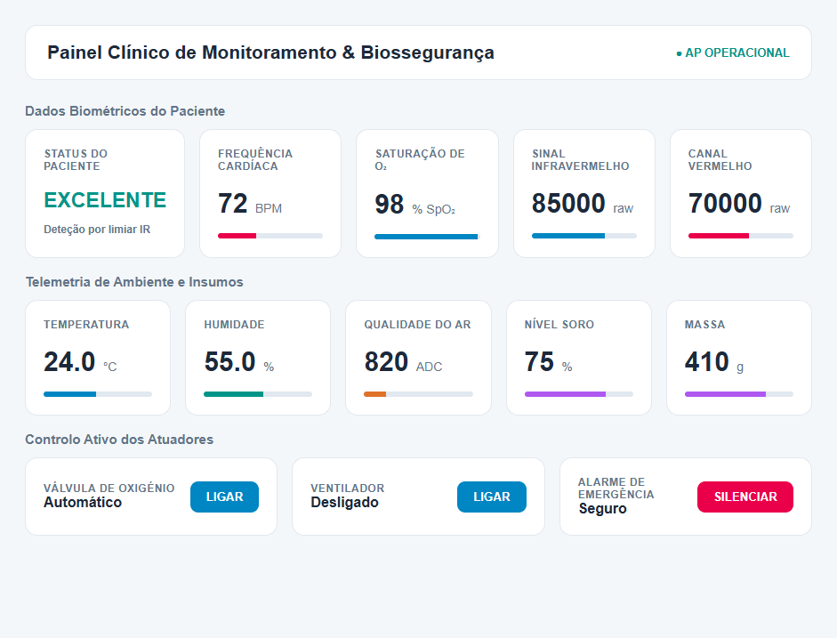

# Hospital IoT

Hospital IoT é um firmware MicroPython para ESP32 que transforma um conjunto de sensores num painel clínico experimental. Monitoriza BPM, SpO₂, temperatura, humidade, qualidade do ar e nível de soro, enquanto controla oxigénio, cooler, dispensador, lâmpada e alarme através de uma interface web local para aprendizagem, prototipagem e estudo de IoT.

Firmware em MicroPython para um sistema experimental de monitorização clínica e automação de um leito hospitalar com ESP32.

O projeto reúne sinais biométricos, condições ambientais, nível de soro e controlo de atuadores num painel web servido diretamente pelo ESP32. Foi desenvolvido para aprendizagem, prototipagem e experimentação com IoT embarcada.

## Interface

Pré-visualização do painel clínico servido pelo ESP32:



> **Aviso importante:** este projeto não é um dispositivo médico e não deve ser usado para diagnóstico, tratamento, administração de oxigénio ou tomada de decisões clínicas. Os valores dos sensores podem estar incorretos e os atuadores podem ser acionados de forma inesperada. Use sempre fontes de alimentação, isolamento elétrico e supervisão adequados.

## Funcionalidades

- Monitorização de frequência cardíaca (BPM) com MAX30102.
- Estimativa de saturação periférica de oxigénio (SpO₂) com MAX30102.
- Deteção de presença do dedo e indicação da qualidade do sinal.
- Leitura de temperatura e humidade com DHT11.
- Leitura analógica de qualidade do ar com sensor da família MQ.
- Medição do peso de um recipiente de soro através de HX711 e célula de carga.
- Conversão do peso do soro em gramas e percentagem.
- Deteção de presença por sensor infravermelho.
- Leitura de botão de chamada com debounce.
- LEDs de indicação da qualidade do ar.
- Controlo de válvula de oxigénio, cooler, dispensador de álcool, lâmpada e buzzer.
- Alarme automático para temperatura elevada, nível baixo de soro, SpO₂ baixa e BPM elevado.
- Histerese no controlo automático de oxigénio: liga abaixo de 92% e desliga a partir de 96%.
- Painel web responsivo com atualização automática a cada 2 segundos.
- API HTTP para consultar dados, enviar comandos e receber dados biométricos remotos.

## Arquitetura

O `main.py` executa várias tarefas assíncronas com `uasyncio`:

1. `task_max30102`: recolhe os canais IR e RED, filtra o sinal e calcula BPM e SpO₂.
2. `task_sensores`: lê DHT11, sensor MQ e HX711, atualiza o controlo de oxigénio e gere o alarme.
3. `task_entradas`: lê o botão e o sensor IR e aciona o pulso do dispensador de álcool.
4. `handle`: serve o painel HTML, a API JSON e os comandos dos atuadores.

O MAX30102 usa I²C por software a 100 kHz. O processamento inclui bloqueio de componente DC, filtro EWMA, filtro de mediana e média aparada dos intervalos entre batimentos.

## Componentes

| Componente | Função |
| --- | --- |
| ESP32 | Microcontrolador e ponto de acesso Wi-Fi |
| MAX30102 | Leitura dos sinais IR/RED, BPM e SpO₂ |
| DHT11 | Temperatura e humidade |
| Sensor MQ com saída analógica | Indicador bruto de qualidade do ar |
| HX711 + célula de carga | Medição do peso do recipiente de soro |
| Sensor IR | Deteção de proximidade/presença |
| Botão | Chamada ou entrada manual |
| LEDs verde, amarelo e vermelho | Indicação da leitura do sensor MQ |
| Atuadores externos | Oxigénio, cooler, álcool, lâmpada e buzzer |

Não ligue motores, válvulas, lâmpadas ou outras cargas diretamente aos GPIOs do ESP32. Use transístores ou módulos de relé adequados, díodos de roda livre para cargas indutivas e uma fonte separada quando necessário.

## Mapa de pinos

| Sinal | GPIO |
| --- | ---: |
| DHT11 | 4 |
| HX711 DT/DOUT | 32 |
| HX711 SCK | 33 |
| Sensor MQ ADC | 34 |
| LED verde | 18 |
| LED amarelo | 19 |
| LED vermelho | 23 |
| I²C SDA do MAX30102 | 21 |
| I²C SCL do MAX30102 | 22 |
| Botão | 13 |
| Sensor IR | 15 |
| Saída oxigénio | 26 |
| Saída cooler | 27 |
| Saída álcool | 25 |
| Buzzer | 14 |
| Lâmpada | 5 |

As entradas do botão e do sensor IR usam `PULL_UP` e são consideradas ativas em nível baixo. Confirme o esquema elétrico antes de ligar o circuito.

## Requisitos

- Placa ESP32 compatível com MicroPython.
- MicroPython com suporte a `machine`, `network`, `uasyncio`, `ujson` e `dht`.
- Cabo USB para gravar o firmware.
- Sensores e módulos ligados conforme o mapa de pinos.
- Computador ou telemóvel com suporte a redes Wi-Fi para abrir o painel.

O projeto não usa bibliotecas externas instaladas por `pip`; os módulos usados são fornecidos pelo MicroPython ou pelo firmware da placa.

## Instalação

1. Instale uma versão recente do MicroPython para ESP32 a partir da [documentação oficial](https://micropython.org/download/ESP32_GENERIC/).
2. Grave o firmware na placa usando uma ferramenta compatível, como `esptool` ou Thonny.
3. Ligue os sensores e atuadores respeitando o mapa de pinos e os níveis de tensão.
4. Copie `main.py` para a raiz do sistema de ficheiros da placa.
5. Reinicie o ESP32.
6. Observe o terminal serial para confirmar a inicialização do MAX30102, DHT11, sensor MQ e HX711.

Exemplo com `mpremote`:

```bash
mpremote connect auto fs cp main.py :main.py
mpremote connect auto reset
```

O comando e a porta podem variar de acordo com o sistema operativo e a placa. Em Windows, também pode ser necessário indicar uma porta, por exemplo `COM3`.

## Configuração e calibração

As configurações estão no início de `main.py` ou junto da inicialização de cada componente.

### Wi-Fi

O ESP32 cria uma rede própria:

- SSID: `Hospital-IoT`
- Palavra-passe: `hospital123`
- Endereço do painel: `http://192.168.4.1/`

As credenciais estão escritas diretamente no código e são apenas adequadas para testes locais. Altere-as antes de qualquer utilização fora de um ambiente controlado. O servidor HTTP não implementa autenticação nem encriptação.

### HX711 e soro

Na inicialização atual:

- Ganho do HX711: `128`.
- Escala: `-435.0`.
- Tara inicial: média de 20 leituras.
- Peso fixo descontado como recipiente: `30 g`.
- Recipiente cheio considerado: `550 g`.

Para calibrar:

1. Ligue a célula de carga sem peso adicional.
2. Confirme que a tara ocorre durante o arranque.
3. Coloque um peso conhecido.
4. Ajuste `hx.set_scale(...)` até a leitura corresponder ao peso real.
5. Ajuste o valor `30.0` se o peso do recipiente for diferente.
6. Ajuste `550.0` se a capacidade considerada do soro for diferente.

Evite calibrar com o recipiente apoiado de forma diferente da montagem final, pois isso altera a leitura.

### Limiares

Os principais limiares atuais são:

- Temperatura crítica: acima de `35 °C`.
- Nível crítico de soro: entre `0%` e menos de `15%`.
- SpO₂ crítica: entre `0%` e menos de `92%`.
- BPM crítico: acima de `120`.
- Qualidade do ar: verde abaixo de `1200`, amarelo de `1200` a `2499`, vermelho a partir de `2500` ADC.

Estes valores são regras de demonstração, não recomendações clínicas. Ajuste-os de acordo com o sensor, o ambiente e a finalidade do protótipo.

## Utilização

1. Ligue o ESP32 e aguarde as mensagens de inicialização.
2. No computador ou telemóvel, conecte-se à rede `Hospital-IoT`.
3. Abra `http://192.168.4.1/` num navegador.
4. Coloque o dedo no MAX30102 e aguarde o preenchimento da janela de amostras.
5. Observe os cartões de BPM, SpO₂, temperatura, humidade, ar e soro.
6. Use os controlos do painel apenas com atuadores de baixa tensão devidamente protegidos.

O dispensador de álcool também pode ser acionado automaticamente quando o sensor IR deteta proximidade. Cada pulso dura aproximadamente `150 ms`.

## API HTTP

### Consultar o estado

```http
GET /api/data
```

Resposta exemplo:

```json
{
  "temperatura": 24.0,
  "humidade": 55.0,
  "gas_bruto": 820,
  "soro_percentagem": 74.5,
  "soro_gramas": 409.8,
  "status_oxigenio": 0,
  "status_cooler": 0,
  "status_alcool": 0,
  "status_lampada": 0,
  "status_botao": "SOLTO",
  "status_ir": "SEM SINAL",
  "alarme_ativo": 0,
  "bpm": 72,
  "oxigenacao": 98,
  "paciente_status": "OK"
}
```

### Controlar um atuador

```http
POST /comando?atuador=cooler&estado=1
POST /comando?atuador=oxigenio&estado=0
POST /comando?atuador=lampada&estado=1
POST /comando?atuador=alcool&estado=0
POST /comando?atuador=alarme&estado=0
```

Os valores `estado` são `0` para desligado e `1` para ligado. Para `alcool`, o estado é ignorado e é criado um pulso. O comando `alarme` silencia as condições críticas que estão ativas naquele momento; uma nova condição crítica volta a ativar o alarme.

### Receber dados biométricos remotos

```http
GET /sensor_update?ir=85000&red=70000&bpm=72&spo2=98&status=OK
```

Este endpoint atualiza os campos remotos `max_ir`, `max_red`, `bpm`, `oxigenacao` e `paciente_status`. Atualmente não há autenticação ou validação robusta de origem, portanto não o exponha a redes não confiáveis.

## Estrutura do projeto

```text
hospitalIOT/
├── main.py      # Firmware MicroPython, servidor HTTP e painel web embutido
└── README.md    # Documentação do projeto
```

## Diagnóstico rápido

| Sintoma | Verificações |
| --- | --- |
| MAX30102 falha | Verifique SDA/SCL, alimentação, endereço I²C `0x57` e massa comum. |
| BPM ou SpO₂ ficam a zero | Mantenha o dedo imóvel, aguarde as amostras e confirme que o IR está acima do limiar de presença. |
| Peso incorreto | Repita a tara, confirme a escala do HX711 e reveja o peso do recipiente. |
| Painel não abre | Confirme a ligação à rede `Hospital-IoT` e use `192.168.4.1`. |
| Atuador não responde | Verifique a alimentação externa, o driver de potência, a massa comum e o GPIO correspondente. |
| Sensor MQ instável | Aguarde o aquecimento do sensor e trate os valores ADC como indicadores relativos, não como ppm calibrados. |

## Segurança e limitações

- O servidor usa HTTP simples, sem autenticação, HTTPS, controlo de acesso ou proteção contra pedidos malformados.
- As credenciais Wi-Fi e os limiares estão expostos no código.
- As leituras de BPM e SpO₂ são estimativas e dependem bastante do sensor, do contacto e do movimento.
- O sensor MQ não fornece uma concentração química confiável sem calibração específica.
- O controlo de oxigénio é uma regra de demonstração e não substitui um controlador médico certificado.
- Use isolamento, fusíveis, proteção contra inversão de polaridade e componentes adequados à carga.
- Não ligue o paciente a qualquer circuito elétrico sem isolamento galvânico e validação profissional.

## Contribuição

Contribuições são bem-vindas. Antes de abrir um pull request:

1. Descreva o hardware e a versão do MicroPython usados.
2. Explique como reproduzir o comportamento alterado.
3. Teste o firmware sem cargas perigosas ligadas.
4. Documente alterações de pinos, limiares, endpoints ou calibração.
5. Não inclua credenciais pessoais ou dados reais de pacientes.

## Autor e contexto

Desenvolvido por **Francisco Brança**.

O Hospital IoT é um projeto open source de aprendizagem, prototipagem e investigação aplicada em IoT, MicroPython, sensores biométricos e automação. O sistema foi criado como uma plataforma experimental para explorar a recolha de dados, o controlo de atuadores e a disponibilização de informação através de uma interface web local. Não representa um produto médico certificado.

## Licença

Este projeto está disponível sob a [Licença MIT](LICENSE).